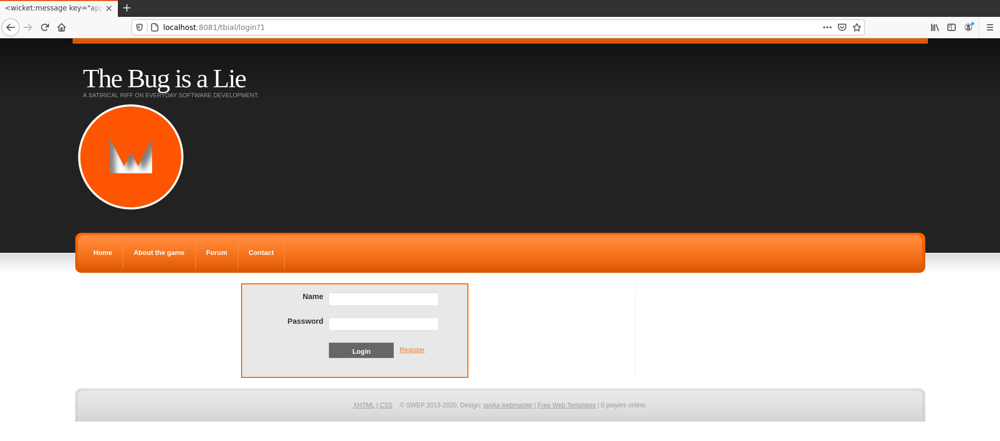

#The Bug is a Lie 🐞

## Spielanleitung

Eine Spielanleitung ist [hier als PDF](TBIAL_Spielanleitung.pdf) verfügbar.

### Vorbereitung

- IDE installieren oder updaten (die Version sollte einigermaßen aktuell sein):
    + *Eclipse IDE for Enterprise Java and Web Developers* (Paket [hier](https://www.eclipse.org/downloads/eclipse-packages/) verfügbar)
      (**Achtung**: das EE Developers Paket wählen!)
    + oder *Intellij IDEA Ultimate Edition* (Paket [hier](https://www.jetbrains.com/idea/download/#section=linux) verfügbar)
- [*Apache Tomcat 9*](http://tomcat.apache.org/) einrichten (Tomcat 10 ist aktuell nicht kompatibel wegen Umstellung auf Jakarta)
    + in Eclipse: `Window/Preferences/Server/Runtime Environment -> Add -> Apache Tomcat v9.0` (`Download and Install...` anklicken, ggf. vorher mit `Browse` einen Ordner für die Installation auswählen)
    + in Intellij: `Run/Edit Configurations -> Templates -> Tomcat Server -> Configure ...`  
      Dies benötigt eine lokale Tomcat-Installation. Die Paketquellen von Ubuntu können
      eine non-konforme Verzeichnisstruktur verwenden, weswegen wir die Verwendung der [offiziellen Pakete](http://tomcat.apache.org/) empfehlen.
- *Apache Derby* installieren und einrichten, Anleitung [hier](https://db.apache.org/derby/papers/DerbyTut/install_software.html#derby) verfügbar (Schritte `Configure Embedded Derby` und `Verify Derby`) nicht nötig).
- *Maven* installieren und einrichten, falls notwendig

### Projekt Setup und Ausführung

- Dieses Projekt-Repository auschecken und den Unterordner
  [`de.lmu.ifi.sosy.tbial`](de.lmu.ifi.sosy.tbial)
  als IDE-Projekt einrichten (Eclipse: `Import -> Existing Projects into Workspace`).
- Apache Derby starten (als separaten Prozess!), ansonsten steht keine Datenbank zur Verfügung
    + Seit Java 9 wird eine sehr aggressive *security policy* durchgesetzt, daher kommt es aufgrund einer Misskonfiguration in der JVM zu einer Exception. Daher Derby mit folgendem Befehl ausführen:
      Mac/Linux:
      ```
      java -Dderby.system.home=.derby -Djava.security.manager -Djava.security.policy=de.lmu.ifi.sosy.tbial/etc/database/security.policy -Dderby.security.port=1527 -Dderby.install.url=file:$DERBY_INSTALL/lib/ -jar $DERBY_INSTALL/lib/derbyrun.jar server start
      ```
      Windows:
      ```
      java -Dderby.system.home=.derby -Djava.security.manager -Djava.security.policy=de.lmu.ifi.sosy.tbial/etc/database/security.policy -Dderby.security.port=1527 -Dderby.install.url=file:%DERBY_INSTALL%/lib/ -jar %DERBY_INSTALL%/lib/derbyrun.jar server start
      ```
      `$DERBY_INSTALL` muss wie in der Derby-Installationsanleitung beschrieben auf den Derby-Installationsordner zeigen.
      
- Aus dem Unterordner `de.lmu.ifi.sosy.tbial` heraus ausführen:
    + `mvn exec:exec@create-development-db` einmalig, um die Datenbank zu initialisieren
    + `mvn install`, um das Projekt zu kompilieren
- Eclipse: `Run on Server`, dann den eingerichteten Tomcat-Server wählen, um das Projekt zu deployen
- Intellij: In der Run Configuration `Tomcat Server -> Deployment -> + -> Artifact -> de.lmu.ifi.sosy.tbial:war`

Sollten bei der erstmaligen Ausführung Fehler wie `ClassNotFound` bzgl. Wicket auftreten,
kann es sein, dass die IDE noch nicht alle benötigten Libraries erkannt hat.
Möglicherweise hilft dann `maven clean` oder ein Neustart der IDE,
gefolgt von den oben genannten Schritten.

### Screenshot

Die Webseite des gegebenen Prototyps sollte in etwa folgendermaßen aussehen:


